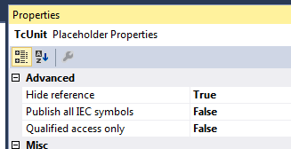

## Frequently asked questions
Here you’ll find the most commonly asked questions and their answers.
If you don’t find what you are looking for here, you can look through the:

- [Open](https://github.com/tcunit/TcUnit/issues?q=is%3Aopen+is%3Aissue) and [closed](https://github.com/tcunit/TcUnit/issues?q=is%3Aissue+is%3Aclosed) issues on GitHub
- [Discussions](https://github.com/tcunit/TcUnit/discussions) on GitHub

---

[How can I run a test across multiple PLC cycles?](#how-can-i-run-a-test-across-multiple-plc-cycles)  
[How can I disable/ignore a test?](#how-can-i-disableignore-a-test)  
[Is there a way to test %I* or %Q* variables?](#is-there-a-way-to-test-i-or-q-variables)  
[Is there a way to hide TcUnit in my libraries?](#is-there-a-way-to-hide-tcunit-in-my-libraries)  
[How do I do assertions on the BIT datatype?](#how-do-i-do-assertions-on-the-bit-datatype)  

---


### How can I run a test across multiple PLC cycles?
This can be accomplished by keeping the function block under test as an instance variable of the test suite rather than the test method.
You can download an [example here](https://tcunit.org/temp/TimedTest_1x.zip).
In this example, the `FB_ToBeTested` is instantiated under the test suite (`FB_ToBeTested_Test`), and can thus be controlled over multiple cycles.
Then all that’s necessary to do is to set the condition for when the assertion should be made in the test itself, which in the example is when the `TestSuiteTimer` has elapsed (`TestSuiteTimer.Q`).

**Required TcUnit version:** 1.0 or later

### How can I disable/ignore a test?
Add `DISABLED_` in front of the test name, for example:

```
TEST('DISABLED_ThisTestWillBeIgnored');
 
AssertEquals(Expected := a,
             Actual := b,
             Message := 'A does not equal B');
 
TEST_FINISHED();
```
**Required TcUnit version:** 1.0 or later

### Is there a way to test %I* or %Q* variables?
In a number of scenarios, TwinCAT won't let you write directly to certain variables:

- Due to access restrictions (e.g. a variable in a FB's VAR)
- The variable being set as I/O (i.e. `AT %I*` or `AT %Q*`)

Writing to these variables wouldn’t make sense and should be prevented in the normal PLC code, so having special privileges during testing is a must.
To support these cases, TcUnit provides helper functions like `WRITE_PROTECTED_BOOL()`, `WRITE_PROTECTED_INT()` (and so forth) for setting these type of variables.
For an example of how to use these, let's assume you have a test:
```
METHOD PRIVATE TestCommsOkChannelsLow
VAR
    EL1008 : FB_Beckhoff_EL1008;
END_VAR
```
Where the `FB_Beckhoff_EL1008` holds a variable:
```
iChannelInput AT %I* : ARRAY[1..8] OF BOOL;
```
Now you might want to write a value to the first channel of the iChannelInput like:
```
TcUnit.WRITE_PROTECTED_BOOL(Ptr := ADR(EL1008.iChannelInput[1]),
                            Value := FALSE);
```
Whereas afterwards you can make an assertion as usual:
```
AssertFalse(Condition := EL1008.ChannelInput[1],
            Message := 'Channel is not false');
```
**Required TcUnit version:** 1.0 or later

### Is there a way to hide TcUnit in my libraries?
You can accomplish this by the [Hide reference](https://infosys.beckhoff.com/english.php?content=../content/1033/tc3_plc_intro/18014402725266443.html&id=) option for referenced libraries.
This option lets you hide TcUnit from your other projects.
Let’s assume you’ve developed a library `MyLibrary`, which has tests written in TcUnit.
You make a PLC project MyProject, which references MyLibrary.

If you use **Hide reference** on TcUnit in `MyLibrary`, then TcUnit won't show up in the imports list of `MyProject`.
You can find it in the Properties tab:




**Required TcUnit version:** 1.0 or later

### How do I do assertions on the BIT datatype?
I want to do an assertion on two variables both declared with the `BIT`-datatype, but I have noticed that a `AssertEquals_BIT()` does not exist.
What do I do?

The reason a `AssertEquals_BIT()` does not exist is that TwinCAT does not allow a BIT-datatype as a variable input.
If you have data declared with the BIT-type, the easiest way to do an assertion on these is to do a `BIT_TO_BOOL()` conversion and use the `AssertEquals_BOOL()`.

```
TEST('Testing_of_BIT_Type');
 
AssertEquals_BOOL(Expected := BIT_TO_BOO(VariableDeclaredAsBit_A),
                  Actual := BIT_TO_BOOL(VariableDeclaredAsBit_B),
                  Message := 'The variables differ');
 
TEST_FINISHED();
```